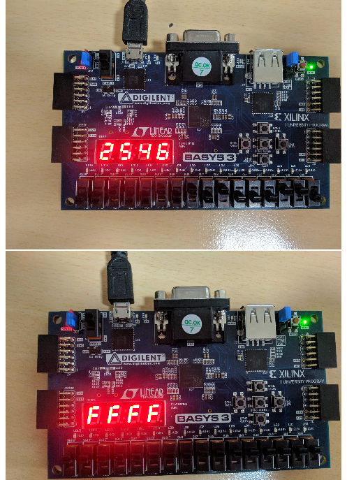

# 7-Segment-Display
This project was a part of the course Digital Logic and System Design taught at IIT Delhi

This repository contains the entire source code along with the report

The entire project is written in VHDL

It is a 7 segment display meant to take input from the 16 switches present on the Basys - FPGA board

To see it in action, connect your board and load the .bit file to it.

